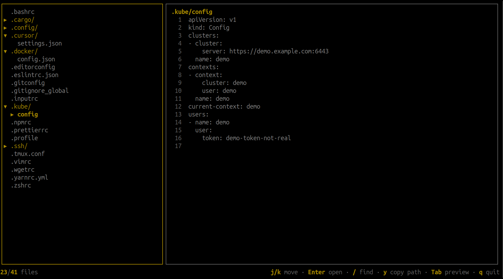
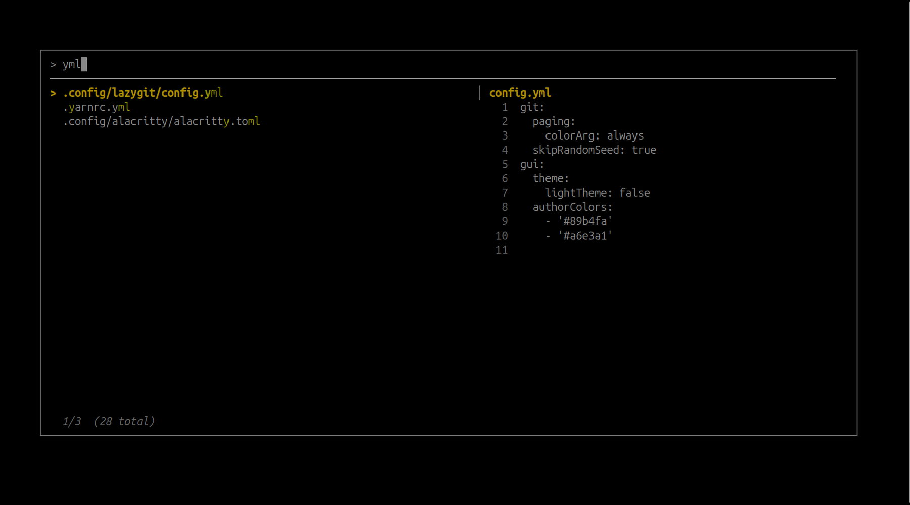

# dotty

Terminal UI for browsing dotfiles under your home directory. Run it from anywhere — it always scans `~`, shows an expandable tree on the left, file preview on the right, and a fuzzy finder to jump to any path quickly.

<p align="center">
  
</p>

<p align="center">
  
</p>

## Install

Run `dotty` from any directory once the binary is on your `PATH`.

### Pre-built binary (recommended)

Download from [Releases](https://github.com/RiccardoCataldi/dotty/releases). Replace `VERSION` with the latest tag (e.g. `v0.1.1`).

| Platform | Asset |
|----------|-------|
| Linux x86_64 | `dotty_Linux_x86_64.tar.gz` |
| Linux ARM64 | `dotty_Linux_arm64.tar.gz` |
| macOS Intel | `dotty_Darwin_x86_64.tar.gz` |
| macOS Apple Silicon | `dotty_Darwin_arm64.tar.gz` |

```bash
VERSION=v0.1.1
curl -sL "https://github.com/RiccardoCataldi/dotty/releases/download/${VERSION}/dotty_Linux_x86_64.tar.gz" | tar xz
install -m 755 dotty ~/bin/   # or: sudo install -m 755 dotty /usr/local/bin/
```

Ensure `~/bin` or `/usr/local/bin` is on your `PATH`.

### From source

Requires Go 1.22+.

```bash
git clone https://github.com/RiccardoCataldi/dotty.git
cd dotty
go install ./cmd/dotty
```

The binary is installed to `$(go env GOPATH)/bin/dotty` (usually `~/go/bin/dotty`). Add that directory to your `PATH` if it is not already — e.g. in `~/.bashrc`:

```bash
export PATH="$HOME/go/bin:$PATH"
```

Or build and copy manually:

```bash
go build -o dotty ./cmd/dotty
mkdir -p ~/bin
mv dotty ~/bin/
export PATH="$HOME/bin:$PATH"   # add to ~/.bashrc to persist
```

### Clipboard (optional)

Copy path (`y`) uses the system clipboard:

| OS | Tool |
|----|------|
| macOS | `pbcopy` (built in) |
| Linux | `xclip` or `xsel` |

## Usage

```bash
dotty
```

The current working directory is ignored; only `$HOME` (or the override below) is scanned.

```bash
dotty --home /path/to/home   # custom root (testing or alternate home)
```

## What gets scanned

Top-level entries in the home directory whose names start with `.` (dotfiles and dot-directories). Directories load children lazily when you expand them in the tree.

Skipped dot-directories (noisy or sensitive):

`.cache` `.local` `.mozilla` `.dbus` `.pki` `.gnupg` `.var` `.snap`

To change the skip list, edit `DefaultBlocklist` in `internal/scan/scan.go`.

## Project layout

```
cmd/dotty/          Program entry point
internal/
  app/              Bubble Tea UI (model, views, keys, fuzzy finder overlay)
  scan/             Home-directory dotfile scanning and tree nodes
  tree/             Expandable tree / visible rows
  preview/          File preview and binary-safe reading
  fuzzy/            Path fuzzy matching for the finder
  clipboard/        OS clipboard integration
  ui/               Lip Gloss styles
docs/               Product notes
```

## Keybindings

### Tree and preview

| Key | Action |
|-----|--------|
| `j` / `k`, `↓` / `↑` | Move selection in the tree |
| `g` / `G` | Jump to first / last visible row |
| `Enter`, `l`, `→` | Expand directory (loads children) or move into selection |
| `h`, `←` | Collapse parent or current directory |
| `Tab` | Toggle focus between tree and preview |
| `j` / `k`, `d` / `u` | Scroll preview (when preview focused) |
| `y` | Copy absolute path of selected **file** to clipboard |
| `q`, `Ctrl+C` | Quit |

### Fuzzy finder (`/`)

Opens an overlay to search all files under scanned dot trees (subdirectories included once expanded or picked).

| Key | Action |
|-----|--------|
| Type | Filter paths (subsequence match, ranked) |
| `j` / `k` | Move through results |
| `Enter` | Jump to file in tree (expands parents) |
| `Esc`, `q` | Close finder |

## Preview

- **Files:** syntax-free text preview (size-capped; large/binary files show a short message).
- **Directories:** placeholder in the preview pane.

## License

MIT
